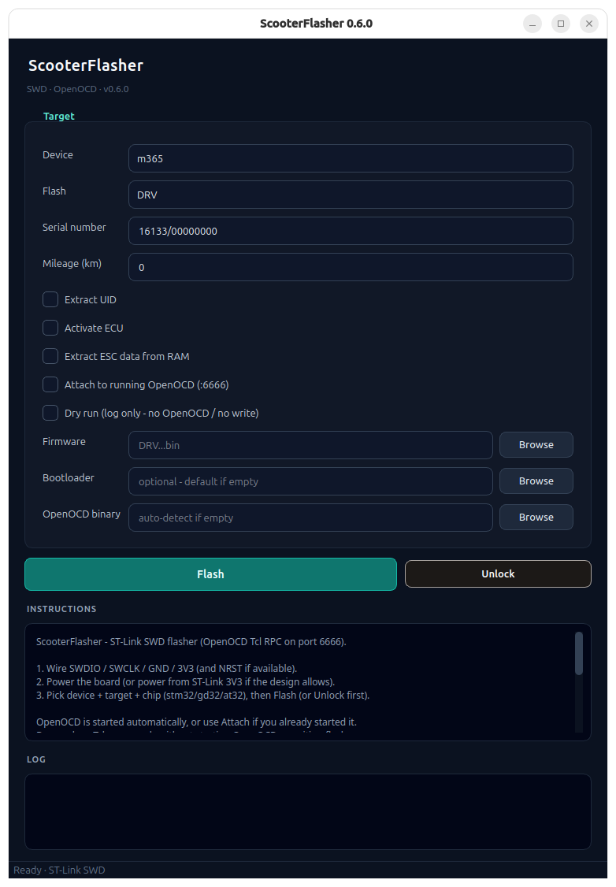

# ScooterFlasher

ScooterFlasher is an OpenOCD / ST-Link SWD flasher for Xiaomi and Ninebot scooters (CLI + GUI).

## Background

ScooterFlasher started as a cross-platform OpenOCD wrapper inspired by [ScooterHacking](https://scooterhacking.org/)’s [ReFlasher](https://www.scooterhacking.org/forum/viewtopic.php?f=14&t=676) - many thanks to that team. The project was later archived, then revived with a PySide6 GUI, persistent OpenOCD sessions, and broader ESC support (including Xiaomi 4 Pro STM32F4 / `4proita`).

## Requirements

- Python ≥ 3.10
- [OpenOCD](https://openocd.org/) on `PATH` (Linux/macOS). Windows users can use the bundled `oocd/bin/openocd.exe`.
- AT32 ESC support needs a build with AT32 scripts ([openocd-at32](https://github.com/encryptize/openocd-at32); Windows build is bundled).

```bash
git clone https://github.com/scooterteam/scooterflasher.git
cd scooterflasher
pip install -r requirements.txt   # runtime: requests + PySide6
# optional CI/dev freeze: pip install -r requirements-build.txt
```

App firmware is selected explicitly (CLI `--cfw` / GUI Firmware). Bootloaders ship in-repo under `binaries/bootloader/` (including `mi_DRV_F4.bin` jump stub for the F4 ESC). Per-model chip allow-lists and bootloader filenames live in `scooterflasher/data/bootloader_matrix.csv`.

## GUI

```bash
python -m scooterflasher
# or
python -m scooterflasher --gui
```



In the GUI, **Flash** is **DRV** (ESC) or **BLE**. **Firmware** is required for Flash. **Dry run** logs what would be sent without starting OpenOCD or writing. Options (SN, km, chip, …) only appear when they apply. **Chip** is `stm32` / `gd32` / `at32` (replaces the old fake-chip checkbox). **Unlock** picks the right path for the selected scooter (F4 RDP, GD32, or STM32F1).

## CLI examples

`--target` is `ESC` (motor controller / DRV) or `BLE` (dashboard). Use `--unlock` alone to clear protection without programming. `--cfw` / `--fw` is required when flashing. `--dry-run` logs Tcl commands without OpenOCD or flash writes.

```bash
# Xiaomi Mi3 ESC (GD32) + firmware, activate, set mileage
python -m scooterflasher -d mi3 --target ESC --sn 32124/00000000 \
  --chip gd32 --km 997 --activate-ecu --cfw your_fw.bin

# Ninebot Max BLE name
python -m scooterflasher -d max --target BLE --sn NBScooter0000 --cfw your_ble.bin

# Attach to OpenOCD you already started (Tcl RPC :6666)
python -m scooterflasher --attach -d m365 --target ESC --sn 16133/00000000 --cfw m365_ESC.bin
```

### Xiaomi 4 Pro F4 (`4proita`)

Catalog **`ninebot.scooter.15`** - MCU **STM32F400CBT6** (≈ F410 / RM0401). This is **not** device `4pro` in this tool (that path is the F1/AT32 / `scooter.v8`-style ESC with flash userdata).

Identity (SN/UUID) lives in **I2C EEPROM**, not MCU flash - ScooterFlasher does not write it. See project docs under `docs/scooters/4pro/` (`f4_jump_boot.md`, `f4_userdata.md`).

Default bootloader: `binaries/bootloader/mi_DRV_F4.bin` (F4 jump stub @ `0x08000000`). App firmware is required and is programmed @ `0x08004000`. Chip is `stm32f4` (matrix / `--chip stm32f4`).

```bash
# 1) Clear RDP (stm32f2x unlock). Then true POR - cut ESC power; NRST is not enough.
python -m scooterflasher -d 4proita --target ESC --unlock

# 2) After power-cycle + OpenOCD back up, program jump boot + app
python -m scooterflasher -d 4proita --target ESC --cfw EC_ESC_Driver_V1.0.1.5.bin

# Optional bootloader override
python -m scooterflasher -d 4proita --target ESC --cbl f4_jump_boot.bin --cfw EC_ESC_Driver_V1.0.1.5.bin
```

OpenOCD target: `stm32f4x` (flash driver command name `stm32f2x`). Sibling kits / pyOCD notes: `firmware/kits/4pro-f4-stlink/`, `scooters/4pro/f4_app_boot/`.

## Releases

Tag `v*` pushes build GUI binaries via GitHub Actions (Linux / macOS / Windows), same pattern as BWFlasher.

## License

GPL-3.0 (see `LICENSE`).
